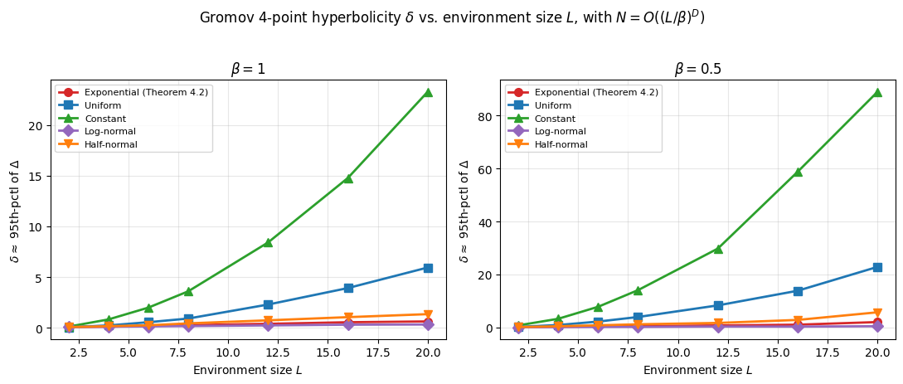

  <!-- <a href="LICENSE">
    
  </a> -->

<div align="center">

<h1 align="center" style="font-size: 28px;">Hyperbolic neural population geometry benefits computation </h1>

<p align="center">
  This repository contains code for the following paper:
</p>

<blockquote align="center">
  <b>Hyperbolic neural population geometry benefits computation</b><br/>
  Dennis Wu, Yi-Chun Hung, Braden Yuille, James E. Fitzgerald*, Han Liu*<br/>
  The International Conference on Machine Learning (ICML) 2026 <br/>
  <!-- <small><a href="https://arxiv.org/abs/2606.10238"><em>[Read the paper]</em></a></small>  -->
  <a href="https://arxiv.org/abs/2606.10238">
     
  </a>

</blockquote>

</div>

## Abstract 

Neural population geometry shapes downstream computation. 
Recent empirical findings in neurobiology suggest that a hyperbolic structure underlies population activity in the hippocampus.
Here we provide a theoretical framework for this phenomenon. 
First, we propose a plausible construction of hippocampal tuning curves that statistically induces hyperbolic geometry. 
Next, we establish a connection between neural decoding and associative memory by demonstrating that the Modern Hopfield Network update rule computes the minimum mean-squared-error (MMSE) estimator.
Finally, we introduce a novel associative memory model defined in hyperbolic space that yields significantly larger capacity than leading models. 
Our results suggest that animals encode spatial information as a latent hyperbolic cognitive map, improving both memory capacity and decoding accuracy.

<div align="center">
  
  <br/>
</div>

<br>

<p>
  This paper shows that under <b>exponentially distributed place field sizes</b>, the population geometry induced by the hippocampal place cells is hyperbolic.
</p>

<p>
  This repository provides implementation for:
</p>

<ul>
  <li><b>Karcher-flow Model:</b> A computational model of associative memory that operates on the hyperboloid model. </li>
  <li><b>Karcher-flow layers:</b> Hyperbolic machine learning layers inspired by the Karcher-flow model.</li>
  <li><b>Hyperbolicity of Gaussian tuning:</b> A tutorial of estimating hyperbolicity for tuning curves under different place field size distributions.</li>
</ul>


### Dependencies

We recommend using Python 3.12.

From the **`hyperbolic-tuning-curve/`** directory:

```bash
uv venv --python 3.12
source .venv/bin/activate  
uv sync
uv pip install -e .
```
___


### Statistically hyperbolic semi-metric space


We provide a short tutorial on verifying whether a semi-metric space is statistically hyperbolic.
See `notebooks/Statistically_hyperbolic.ipynb` for more details.
The results show that both the exponential distribution and the log-normal distribution are able to induce a semi-metric space that is statistically hyperbolic, which are the two place field size distributions reported in [Zhang et al. 2022](https://www.nature.com/articles/s41593-022-01212-4#Sec8).

<div align="center">
  

</div>

___


### Pattern Completion

```bash
python main.py --M-min 10 --M-max 100 --pca-dim 10 --dataset mnist --mem-R 3 --beta 1 --noise_sigma 0.3

python main.py --M-min 10 --M-max 100 --pca-dim 10 --dataset cifar10 --mem-R 3 --beta 1 --noise_sigma 0.3
```

We provide an example of running pattern completion on your own dataset
```python
import os
os.environ["GEOMSTATS_BACKEND"] = "numpy"

import numpy as np
import torchvision
import torchvision.transforms as transforms
from tqdm import tqdm

from memory import *

M = 100
rng = np.random.default_rng()

# Load images
transform = transforms.Compose([transforms.ToTensor()])
data = torchvision.datasets.FashionMNIST(
    root="./data", train=True, download=True, transform=transform
)
indices = rng.choice(len(data), size=M, replace=False)
images = []
for idx in indices:
    img, _ = data[int(idx)]
    images.append(img.numpy().flatten())

# PCA preprocessing
X = np.array(images, dtype=np.float64)
X_red = image_pca_and_rescale(X, 10, 2)

# Project points to the hyperboloid
H = HyperboloidKappa(dim=10, curvature=-1)
points = to_hyperboloid(H, X_red)

# Add perturbation
query_on_manifold = add_noise(H, 0.3, points, rng)
query_euclidean = add_noise_euclidean(0.3, X_red, rng)

# Recall
steps = 64
cor_kfm = kfm(H, points, query_on_manifold, steps, beta=1)
cor_mhn = mhn(X_red, query_euclidean, steps, beta=1)
cor_dam = dam(X_red, query_euclidean, steps, beta=1)
tqdm.write(
    f"M={M} kfm: {cor_kfm}/{M} mhn: {cor_mhn}/{M} dam: {cor_dam}/{M}"
)
```

___

### Machine Learning Tasks

Benchmarks Karcher-flow (`kf_*`), Hopfield (`hf_*`), and Einstein (`ein_*`) attention via [`main_ml.py`](main_ml.py). Implementation lives under [`ml/hyphop/`](ml/hyphop/).

**MNIST classification**

```bash
python main_ml.py --task mnist --model kf_attention --hidden-dim 8 # single run
python main_ml.py --task mnist --model ein_attention --hidden-dim 32 --epochs 14 --device cuda # single run for the einstein midpoint baseline
python main_ml.py --task mnist --benchmark # reproduce tables in the paper
```

Output: `ml/hyphop/results/mnist/mnist_benchmark_results.csv`

___

**Multiple instance learning**

Data download

```bash
mkdir -p ml/hyphop/datasets/mil_datasets
cd ml/hyphop/datasets/mil_datasets

wget http://www.cs.columbia.edu/~andrews/mil/data/MIL-Data-2002-Musk-Corel-Trec9-MATLAB.tgz
tar zxvf MIL-Data-2002-Musk-Corel-Trec9-MATLAB.tgz
find . -name '*.mat' -exec mv -n -t . {} +
```

Datasets: `tiger`, `fox`, `elephant`. Pooling models (`*_pooling`) are the default benchmark setting.

Single run:

```bash
python main_ml.py --task mil --dataset fox --model kf_pooling # single run
python main_ml.py --task mil --dataset elephant --model ein_pooling --epochs 100 # single run
python main_ml.py --task mil --benchmark # reproduce tables in the apper
```

Output: `ml/hyphop/results/mil/mil_benchmark_results.csv`

Run a script with `--help` for the full list, e.g. `python ml/hyphop/test_mnist.py --help`.

___

### Cite

If you find this work useful, please consider citing our paper:
```bibtex
@inproceedings{
wu2026hyperbolic,
title={Hyperbolic neural population geometry benefits computation},
author={Dennis Wu and Yi-Chun Hung and Braden Yuille and James E Fitzgerald and Han Liu},
booktitle={Forty-third International Conference on Machine Learning},
year={2026},
url={https://openreview.net/forum?id=WXNjDNDnpy}
}```
